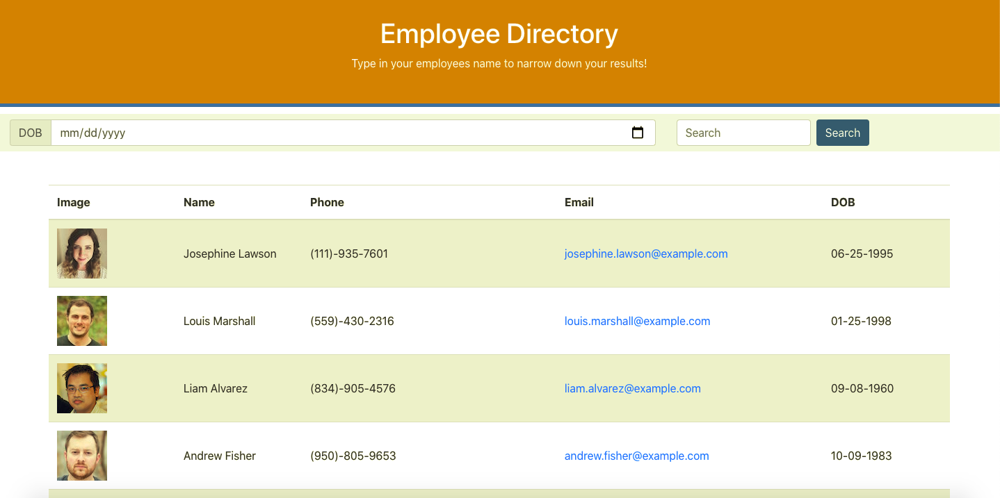

## Employee-Directory
I am a Full Stack Developer and this is a Employee-Directory using React

## Description
This is an application that allows an employee or manager to benefit greatly from being able to view non-sensitive data about other employees. 
This project was bootstrapped with [Create React App](https://github.com/facebook/create-react-app).
API that was used was 
* randomuser.me

## User-Story
As a user, I want to be able to view my entire employee directory at once so that I have quick access to their information.

## Directions
To run the app first 
* copy repository and clone it down into VS code *or run the app using the deployed link*
* npm start
* open in the browser

## Application Screenshots

## Deployed Link

https://bethtgreen.github.io/Employee-Directory/

## Lint
Lint errors have been disabled.

